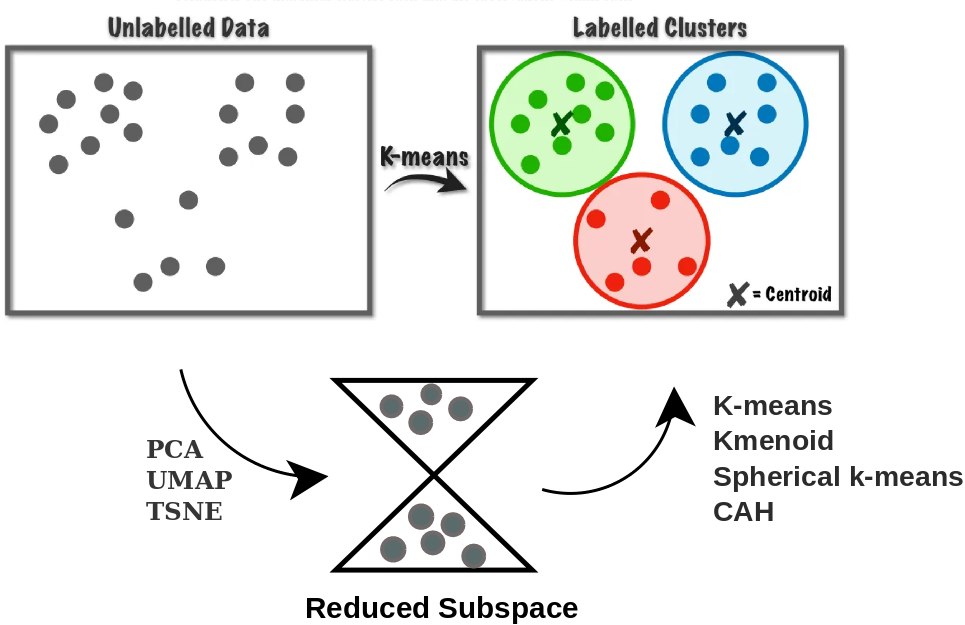
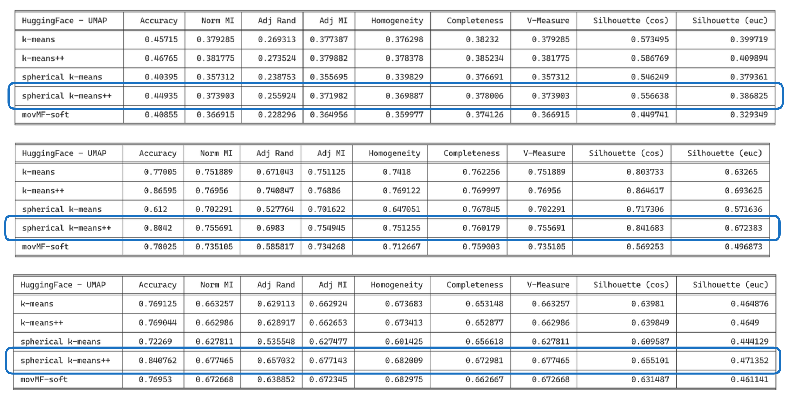

<h1 align="center">⚡️ short-text-clustering </h1>

<h4 align="center">
    

        <a href="#Tandem-approach-for-short-text-clustering">Tandem approach for short text clustering</a> •
        <a href="#Installation">Installation</a> •
        <a href="#Experiments-and-results">Experiments and results</a>
    

</h4>

<h3 align="center">
    
</h3>

# Tandem approach for short text clustering

The tandem approach in clustering combines dimensionality reduction, which reduces the complexity of
data while retaining relevant information, with clustering, which groups similar data point

# Installation

# Experiments and results

Let's check results in table below, biomedical, stackoverflow and searchsnippets (top to bottom resp.). We apply on  HuggingFace embedding () UMAP dimensionality reduction followed by clustering algorithm like skmeans++ or sphérical-kmeans++. Important results are highlighted.

## Spherical kmeans++

## kmeans++

