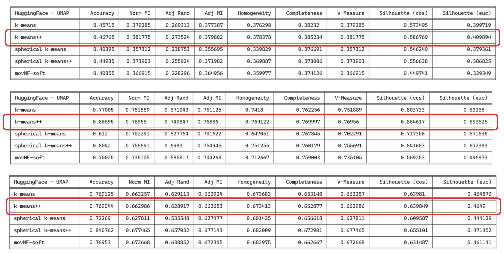

<h1 align="center">⚡️ short-text-clustering </h1>

<h4 align="center">
    

        <a href="#Objectif">Objectif</a> •
        <a href="#Les-fonctionnalités">Les fonctionnalités</a> •
        <a href="#Lancement">Lancement</a> •
    

</h4>

<h3 align="center">
    
</h3>

# Tandem approach for short text clustering

The tandem approach in clustering combines dimen-
sionality reduction, which reduces the complexity of
data while retaining relevant information, with clus-
tering, which groups similar data point

# Installation

# Results

Let's check results in table below, biomedical, stackoverflow and searchsnippets (top to bottom resp.). We apply on  HuggingFace embedding () UMAP dimensionality reduction followed by clustering algorithm like skmeans++ or sphérical-kmeans++. Important results are highlighted.

## Spherical kmeans++

## kmeans++

